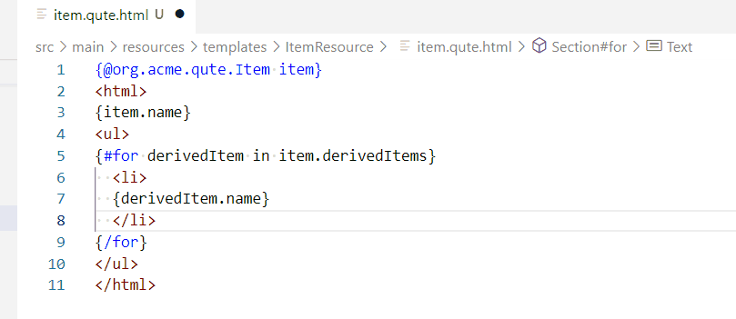
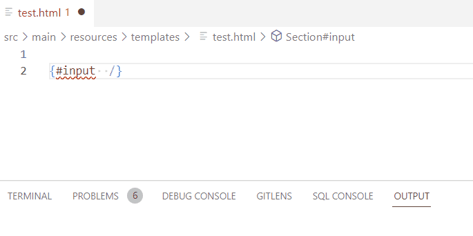
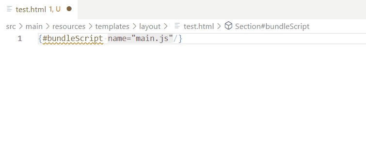

# Qute Template support

Qute support provides `completions`, `validation`, `hover`, `definition`, `highlight`, `linked editing` in Qute templates.

To benefit from this support, HTML, Text, YAML and JSON files in `**/resources/templates/**` are automatically opened as Qute templates. You can disable that behavior by setting the `quarkus.tools.propertiesLanguageMismatch` property to `ignore`, or `prompt` if you prefer being asked to change the type when opening the file. 

## Parameter declaration support

A `parameter declaration` is used to declare the expected model in a Qute template:

```
{@java.util.List<org.acme.qute.Item> items}
```

The Qute support helps to easily write this declaration with the completion, hover and definition support.

### Completion for Java types

The Qute support provides completion to easily write parameter declaration:


### Validate Java type

The Qute support validates Java types:


### Jump to Java type definition

You can jump to the proper Java type:


## Section support

### Completion for Qute section

Qute support provides snippets to quickly generate `Qute` sections. Here is a sample for the `#for` section:


### Linked editing

Linked editing is supported, allowing for simultaneous renaming of a parameter expression.

To enable this feature, the setting `editor.linkedEditing` must be set to `true` in your `settings.json`.


## Tag Name Highlighting

When placing the cursor on a Qute section tag, the corresponding opening/closing tag will be highlighted with their nested block:


## Expression support

A Qute expression is declared inside `{|}` or inside a section (ex : `{#for item in |}`).

### Completion for Java data model

Completion is available for allowed Java `fields`, `methods` and `virtual methods` (coming from the Qute core like `orEmpty` or coming from @TemplateExtension):


### Validation for Java data model

Validation highlights unknown Java fields or methods as an error:


### Hover for Java data model

When you hover over an object, property or method or virtual method (for `@TemplateExtension`), you can see the Java type:


When you hover over a [Built-in Resolvers](https://quarkus.io/guides/qute-reference#built-in-resolvers) you can see the relevant documentation, with a link to the [Qute reference guide](https://quarkus.io/guides/qute-reference):


### Jump to Java field, method definition

`Ctrl+Click` on a property or method to jump to the definition of the matching Java field, method or virtual method (for `@TemplateExtension`):



### Jump to the declared object

A variable can be declared inside a Qute template (with parameter declaration, or #let section) or declared from the Java side.

`Ctrl+Click` on an object part jumps to the declared object in the Qute template (with parameter declaration, or #let section) or to the Java code (method parameter or data method invocation):


## User tags support

The [User tags](https://quarkus.io/guides/qute-reference#user_tags) are loaded from `src/main/resources/templates/tags`. The parameters and presence of `{nested-content}` in the user tag declared in the tag template is used to provide support for completion, definition, and validation in the Qute template:



## Quarkus integration for Qute

When the template is used in a Quarkus application and it is bound with a Java Template field or a method annotated with `@CheckedTemplate`, you can see the expected model as CodeLens:


In this case, you don't need to declare parameter declaration to benefit from Qute completion, validation, etc. of the Java data model.

CodeLens are clickable to jump to the proper Java type, method or field.

## Inlay Hint for Qute

All inlay hints can be turned off by disabling `qute.inlayHints.enabled` in settings.

### Show Section parameter type

Qute support displays the Java type of the parameter names as an inlay hint.


To remove inlay hints on section parameter types only, disable `qute.inlayHints.showSectionParameterType` in settings.

### Show Section parameter default value

Qute support displays the default value of the parameter names as an inlay hint when user tag defines a default value (ex: `{#let name?="main.css"}`)



To remove inlay hints on section parameter default value only, disable `qute.inlayHints.showSectionParameterDefaultValue` in settings.
 
## Surround with Commands (Wrap)

This command provides the ability to select Qute content and surround it some content. To execute this command you can use the command palette (`Ctrl+Shift+P`) and type `Surround`.

If you prefer using keyboard to process the command, you need to associate this command with a keybinding. See [Keyboard Shortcuts editor](https://code.visualstudio.com/docs/getstarted/keybindings#_keyboard-shortcuts-editor) for more informations.

### Surround with Section

Surrounds the selected content with a section and completion will be triggered. You can also do an empty section on the section you would like to surround and the correct section will selected.

Here is an example use case with `#for` section:


Here is an another example use case with `#if` section:


### Surround with Comments

This command can also be used to comment out the selected content.


### Surround with Unparsed Character Data

Similar to `Surround with Comments`, This command can also be used to indicate Unparsed Character Data.


