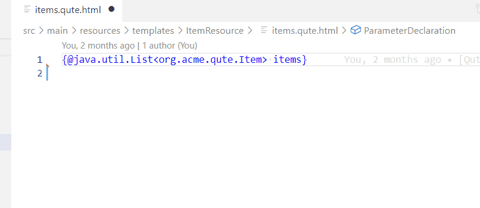
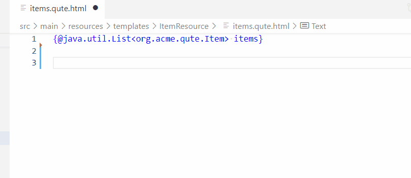
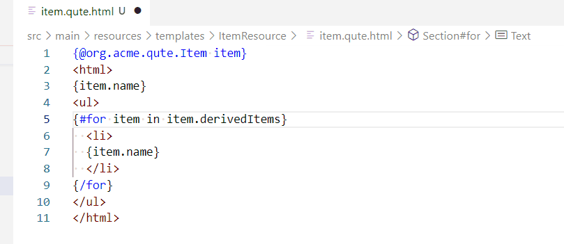
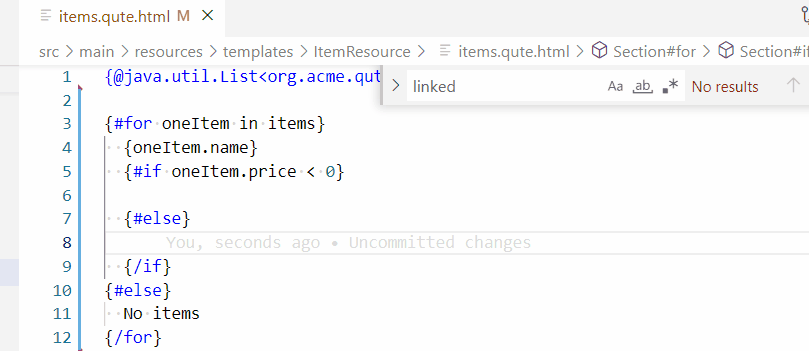
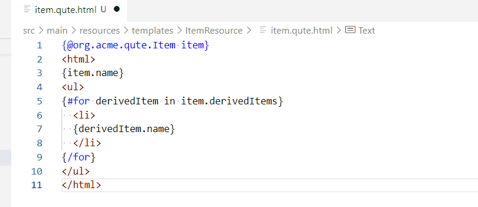
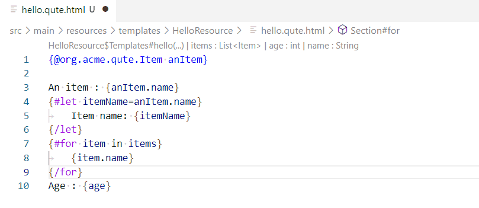
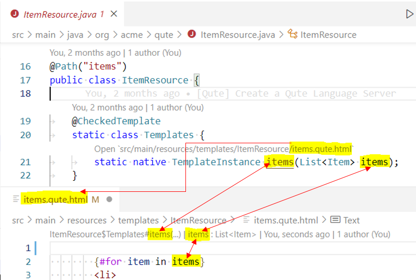

# Qute Template support

Qute support provides `completions`, `validation`, `hover`, `definition`, `highlight`, `linked editing` in Qute template.

To benefit with this support, we recommend your template files to follow the `*.qute.*` naming pattern (ex: `items.qute.html`, `items.qute.txt`, `items.qute.yaml`, etc.).

## Parameter declaration support

A `parameter declaration` is used to declare the expected model in a Qute template:

```
{@java.util.List<org.acme.qute.Item> items}
```

The Qute support helps to easily write this declaration with the completion, hover and definition support.

### Completion for Java types

The Qute support provides completion to easily write parameter declaration:


### Validate Java type

The Qute support validates Java types:


### Jump to Java type definition

You can jump to the proper Java type:



## Section support

### Completion for Qute section

Qute support provides snippets to quickly generate `Qute` sections. Here is a sample for the `#for` section:



### Linked editing

Linked editing is supported, allowing for simultaneous renaming of a parameter expression.

To enable this feature, the setting `editor.linkedEditing` must be set to `true` in your `settings.json`.



## Tag Name Highlighting

When placing the cursor on a Qute section tag, the corresponding opening/closing tag will be highlighted with their nested block:



## Expression support

A Qute expression is declared inside `{|}` or inside a section (ex : `{#for item in |}`).

### Completion for Java data model

Completion is available for allowed Java `fields`, `methods` and `virtual methods` (coming from the Qute core like `orEmpty` or coming from @TemplateExtension):


### Validation for Java data model

Validation highlights unknown Java fields or methods as an error:


### Hover for Java data model

When you hover over an object, property or method or virtual method (for `@TemplateExtension`), you can see the Java type:



When you hover over a [Built-in Resolvers](https://quarkus.io/guides/qute-reference#built-in-resolvers) you can see the relevant documentation, with a link to the [Qute reference guide](https://quarkus.io/guides/qute-reference):


### Jump to Java field, method definition

`Ctrl+Click` on a property or method to jump to the definition of the matching Java field, method or virtual method (for `@TemplateExtension`):


### Jump to the declared object

A variable can be declared inside a Qute template (with parameter declaration, or #let section) or declared from the Java side.

`Ctrl+Click` on an object part jumps to the declared object in the Qute template (with parameter declaration, or #let section) or to the Java code (method parameter or data method invocation):



## Quarkus integration for Qute

When the template is used in a Quarkus application and it is bound with a Java Template field or a method annotated with `@CheckedTemplate`, you can see the expected model as CodeLens:



In this case, you don't need to declare parameter declaration to benefit from Qute completion, validation, etc. of the Java data model.

CodeLens are clickable to jump to the proper Java type, method or field.